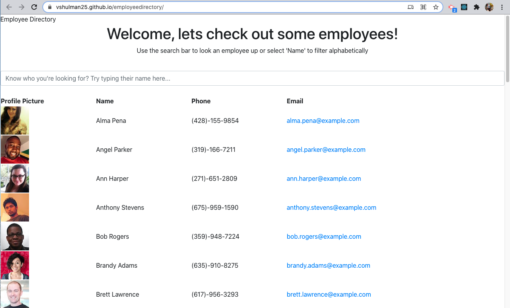
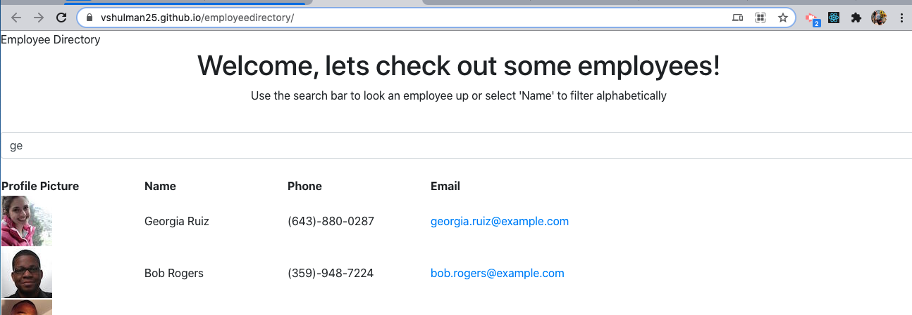
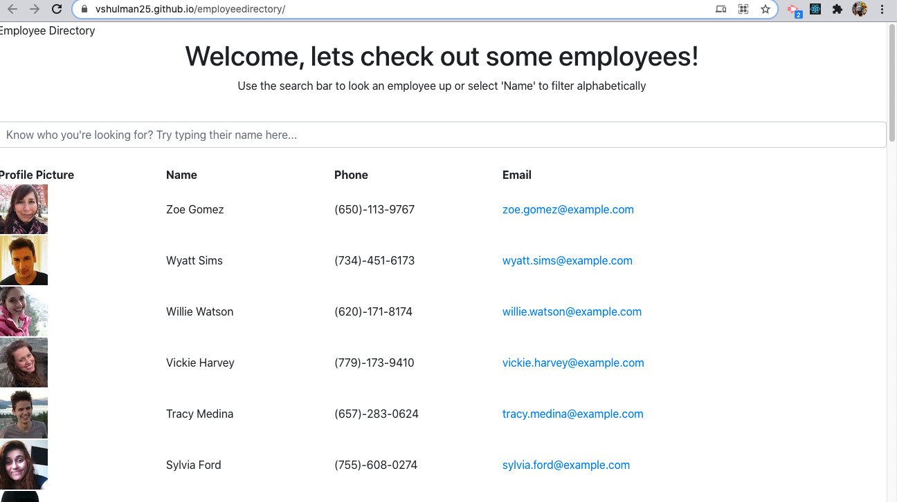

# Unit 19 React Homework: Employee Directory

## Overview

For this assignment, I created a employee directory with React. This assignment will required breaking my application's UI into components, manage component state, and respond to user events.

## User Story

* As a user, I want to be able to view my entire employee directory at once so that I have quick access to their information.

## Development

Random users are generated using [Random User API](https://randomuser.me/), when the user loads the page, a table of employees will render. 

User is be able to:

  * Sort the table by at employee names alphabetically in ascending or descending order

  * Filter the users by letters in employee names utilizing the search bar

  * App page will update when refreshed

App is deployed using GitHub Pages, live link is listed below with link to GitHub Repository.

---

## Links
* [Live Link](http://vshulman25.github.io/employeedirectory)
* [Repository](https://github.com/vshulman25/employeedirectory.git)

---
## Preview

---
## Credits

Developer - Victoria Shulman 
